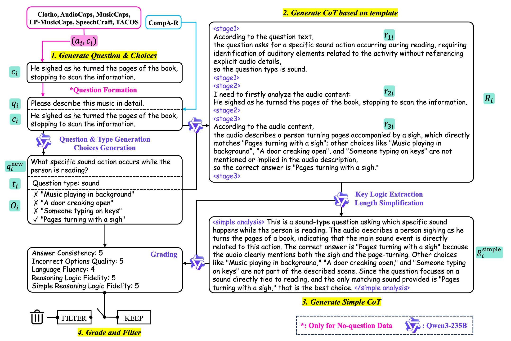
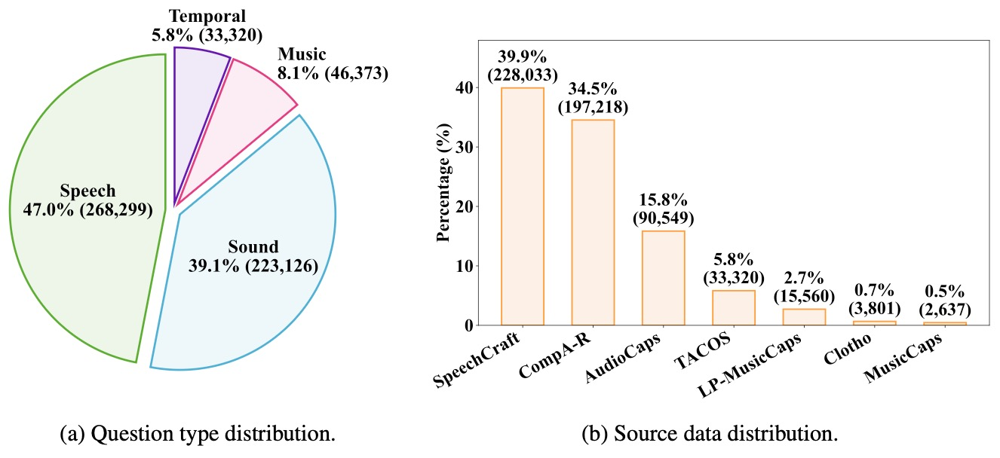
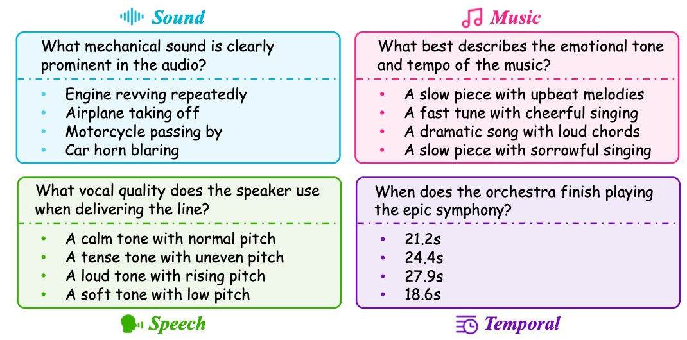

# [ICLR 2026] AudioMCQ: Audio Multiple-Choice Question Dataset

**Official repository for the paper "Measuring Audio's Impact on Correctness: Audio-Contribution-Aware Post-Training of Large Audio Language Models"**

<div align="center">

[](https://arxiv.org/abs/2509.21060)
[](https://github.com/inclusionAI/AudioMCQ)
[](https://dcase.community/challenge2025/task-audio-question-answering-results)
[](https://dcase.community/challenge2026/index#task5)
[](#-audiomcq-strongac-geminicot-dcase-2026-task-5)

</div>

## News

- **[2026.03]** 🔥 We released **[AudioMCQ-StrongAC-GeminiCoT](#-audiomcq-strongac-geminicot-dcase-2026-task-5)**, a highly curated subset featuring native CoT reasoning from Gemini 3.1 Pro! It proudly serves as the official training set for **[DCASE 2026 Challenge Task 5](https://dcase.community/challenge2026/index#task5)**. 
- **[2026.02]** Paper accepted by ICLR 2026.
- **[2025.09]** Paper published on arXiv.
- **[2025.09]** AudioMCQ dataset released with 571k samples!
- **[2025.07]** We achieve **[1st place](https://dcase.community/challenge2025/task-audio-question-answering-results)** in the DCASE 2025 Audio-Question-Answering challenge by using AudioMCQ!

## Quick Links

- **Dataset**: [https://huggingface.co/datasets/inclusionAI/AudioMCQ](https://huggingface.co/datasets/inclusionAI/AudioMCQ)
- **Paper**: [https://arxiv.org/abs/2509.21060](https://arxiv.org/abs/2509.21060)
- **DCASE 2025 Challenge**: [1st Place Results](https://dcase.community/challenge2025/task-audio-question-answering-results)

## Overview

AudioMCQ is a comprehensive audio multiple-choice question dataset with **571k samples** designed for post-training Large Audio Language Models (LALMs). The dataset features dual chain-of-thought annotations and audio-contribution filtering, achieving state-of-the-art results in audio understanding tasks.

<div align="center">
  
  <p><i>Overview of dataset construction pipeline.</i></p>
</div>

<div align="center">
  
  <p><i>Distribution analysis of AudioMCQ dataset.</i></p>
</div>

<div align="center">
  
  <p><i>Randomly sampled questions from four distinct question types.</i></p>
</div>

### Key Highlights

- **571k high-quality samples** across sound, music, speech, and temporal domains
- **Dual CoT annotations**: Structured and unstructured reasoning paths
- **Audio-Contribution filtering**: Weak (54.8%) and strong (45.2%) splits
- **Pre-trained models available**: Weak-to-Strong and Mixed-to-Strong paradigms

## Dataset Access

**For complete dataset information, statistics, data format, and download instructions, please visit:**

### [Hugging Face Dataset Repository](https://huggingface.co/datasets/inclusionAI/AudioMCQ)

The Hugging Face repository contains:
- Full dataset documentation
- Detailed statistics and examples
- Data format specifications
- Download links for audio files
- Usage instructions
- Model checkpoints

## Model Checkpoints

We provide trained model checkpoints for two post-training paradigms:

| Training Paradigm | Hugging Face Link |
| :--- | :--- |
| **Weak-to-Strong** | [inclusionAI/AudioMCQ-Weak-To-Strong](https://huggingface.co/inclusionAI/AudioMCQ-Weak-To-Strong) |
| **Mixed-to-Strong** | [inclusionAI/AudioMCQ-Mixed-To-Strong](https://huggingface.co/inclusionAI/AudioMCQ-Mixed-To-Strong) |

## Training Scripts

All training code used for this project can be found in the `/training_scripts` directory.

## Contact

- **Haolin He**: [harlandzzc@link.cuhk.edu.hk](mailto:harlandzzc@link.cuhk.edu.hk)

## Contributors

<a href="https://github.com/inclusionAI/AudioMCQ/graphs/contributors">
  
</a>

## Citation

If you find AudioMCQ useful in your research, please cite:
```bibtex
@inproceedings{he2025audiomcq,
  title={Measuring Audio's Impact on Correctness: Audio-Contribution-Aware Post-Training of Large Audio Language Models},
  author={He, Haolin and others},
  booktitle={Proceedings of the International Conference on Learning Representations (ICLR)},
  year={2026}
}
```

## Acknowledgements

We thank the organizers of DCASE 2025 and the research community for their valuable feedback and support.

## Related Resources

- [Qwen2.5-Omni](https://github.com/QwenLM/Qwen2.5-Omni)
- [DCASE 2025 Challenge](http://dcase.community/challenge2025/)
- [R1-AQA Evaluation Format](https://github.com/xiaomi-research/r1-aqa)
